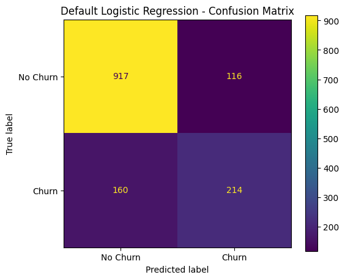
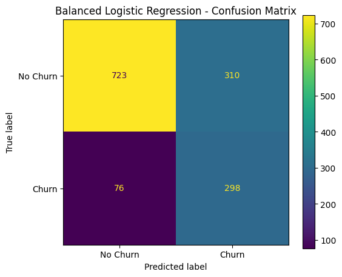

# Telco Customer Churn - Classification Baseline

## Objective

Build and evaluate Logistic Regression models for predicting customer churn and compare them with a majority-class baseline.

## Data Preparation

- TotalCharges was converted to numeric.
- 11 invalid/blank TotalCharges values were removed.
- customerID was removed.
- Categorical variables were one-hot encoded.
- Numerical variables were standardized.
- Preprocessing was performed inside a scikit-learn pipeline.

## Train/Test Split

- 80% training data
- 20% testing data
- Stratified split using stratify=y

## Model Comparison

| Model | Accuracy | Precision | Recall | F1 | ROC-AUC |
|---|---:|---:|---:|---:|---:|
| Majority-Class Baseline | 0.7342 | 0.0000 | 0.0000 | 0.0000 | N/A |
| Logistic Regression (Default) | 0.8038 | 0.6485 | 0.5722 | 0.6080 | 0.8359 |
| Logistic Regression (Balanced) | 0.7257 | 0.4901 | 0.7968 | 0.6069 | 0.8351 |

## Confusion Matrices

### Default Logistic Regression

Confusion Matrix:

[[917, 116],
 [160, 214]]

- True Negatives: 917
- False Positives: 116
- False Negatives: 160
- True Positives: 214

### Balanced Logistic Regression

Confusion Matrix:

[[723, 310],
 [76, 298]]

- True Negatives: 723
- False Positives: 310
- False Negatives: 76
- True Positives: 298

## Business Interpretation

The majority-class baseline achieves 73.42% accuracy but detects none of the actual churners, resulting in 0% recall.

The default Logistic Regression achieves 80.38% accuracy, 64.85% precision, and 57.22% recall.

The balanced Logistic Regression increases recall to 79.68% and reduces false negatives from 160 to 76. However, false positives increase from 116 to 310 and precision decreases to 49.01%.

Because missing a churner is assumed to be more costly than generating a false alarm, the balanced model provides an operating point that prioritizes detecting more potential churners.

The two Logistic Regression models have very similar F1 and ROC-AUC values, showing that class weighting mainly changes the precision-recall tradeoff.

## Threshold Awareness

Both models use a default classification threshold of 0.5.

In a production environment, the threshold can be adjusted according to the business cost of false negatives and false positives.

## Conclusion

Accuracy alone is not sufficient for evaluating this imbalanced churn problem. The majority-class baseline demonstrates this clearly because it has reasonable accuracy but fails to detect churners.

The comparison shows that default and balanced Logistic Regression provide different precision-recall tradeoffs. The appropriate configuration depends on the relative business costs of missed churners and false alarms.
